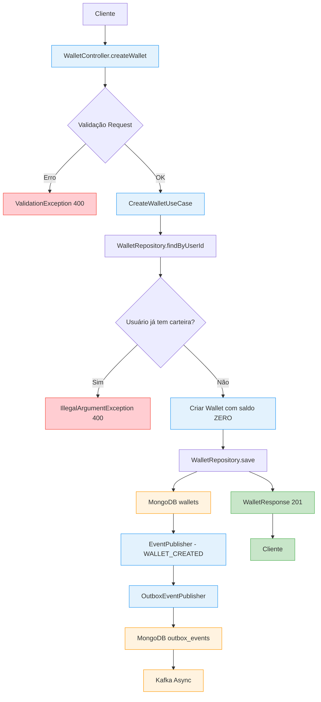
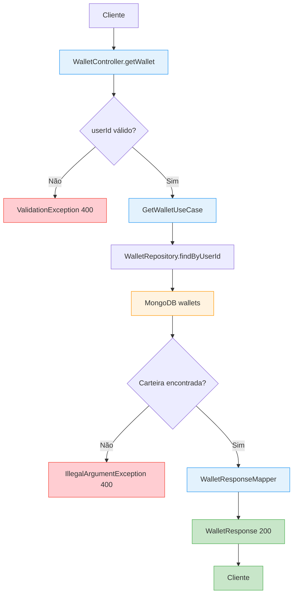
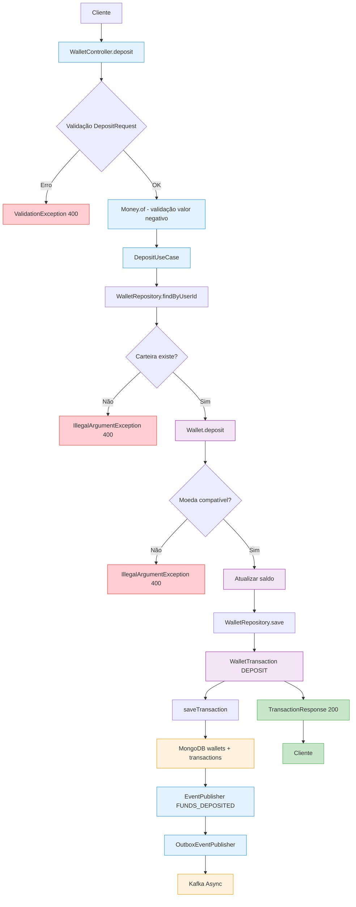
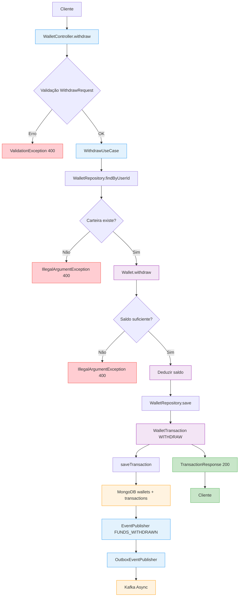
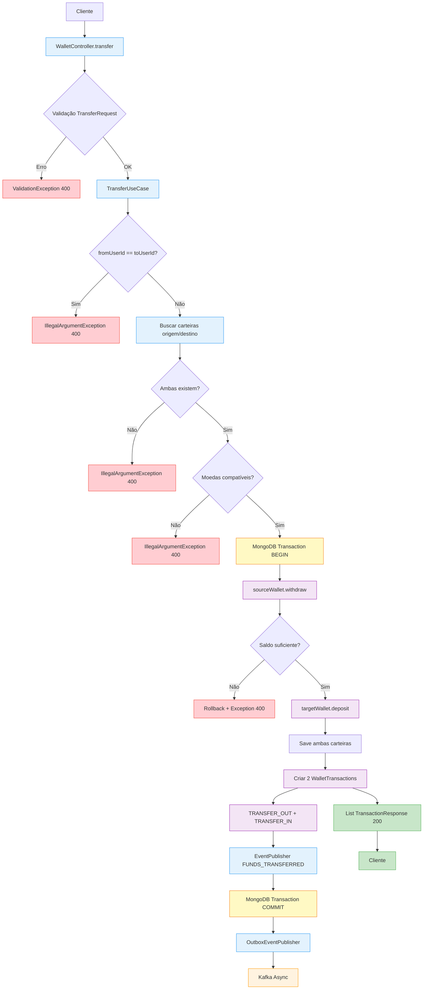
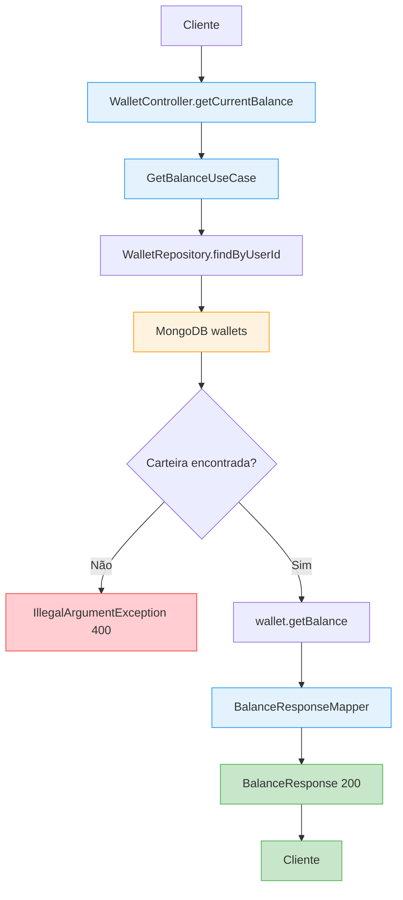
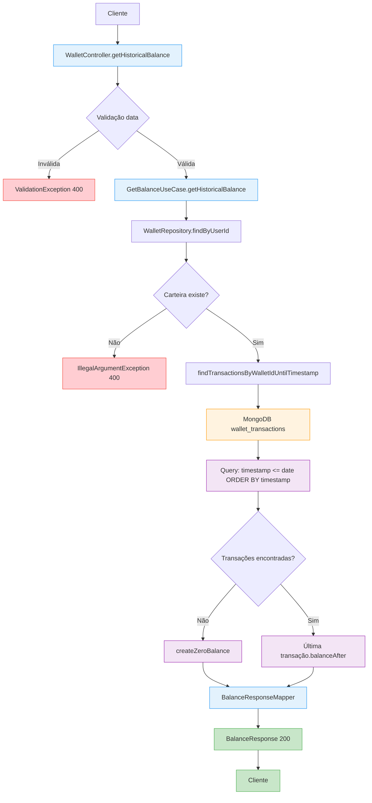

# Wallet Service - Documentação Técnica

## 📋 Visão Geral

O **Wallet Service** é um serviço de carteira digital que permite aos usuários gerenciar fundos através de operações básicas como criação de carteira, depósitos, saques e transferências. O sistema foi projetado com foco em **consistência de dados**, **rastreabilidade** e **resiliência** utilizando padrões como Clean Architecture e Outbox Pattern.

### Funcionalidades Principais

- ✅ **Criação de Carteira** - Permite criar carteiras para usuários
- ✅ **Consulta de Saldo** - Recupera saldo atual e histórico
- ✅ **Depósito de Fundos** - Adiciona fundos à carteira
- ✅ **Saque de Fundos** - Remove fundos da carteira
- ✅ **Transferência** - Move fundos entre carteiras de usuários
- ✅ **Auditoria Completa** - Rastreamento de todas as operações via eventos

---

## 🏗️ Decisões de Arquitetura

### Exemplo da Arquitetura do projeto - Clean Architecture Multi-Module Simplificada

Mais a frente na documentação terá uma melhor visão sobre a arquitetura real.


### Clean Architecture Multi-Módulo

**Por que Clean Architecture?**
- **Separação de Responsabilidades:** Cada camada tem uma responsabilidade específica
- **Independência de Framework:** Core isolado de dependências externas
- **Testabilidade:** Facilita criação de testes unitários e de integração
- **Manutenibilidade:** Mudanças em uma camada não impactam outras

**Estrutura dos Módulos:**

```
wallet-service/
├── wallet-core/          # Regras de negócio puras (domain, use cases, ports)
├── wallet-dataprovider/  # Implementação de adapters (MongoDB, Kafka)
├── wallet-entrypoint/    # Controllers REST e DTOs
└── wallet-config/        # Configurações centralizadas e aplicação principal
```

### MongoDB como Banco de Dados

**Por que MongoDB?**
- ✅ **Flexibilidade de Schema:** Permite evolução dos modelos sem migrations complexas
- ✅ **Transações ACID:** Suporte nativo a transações (essencial para transferências)
- ✅ **Performance:** Excelente performance para reads e writes
- ✅ **Escalabilidade Horizontal:** Facilita crescimento futuro
- ✅ **Indexes Flexíveis:** Otimização de consultas por userId, timestamp, etc.

### Apache Kafka para Eventos

**Por que Kafka (ou Redpanda)?**
- ✅ **Auditoria Completa:** Histórico imutável de todas as operações
- ✅ **Processamento Assíncrono:** Permite funcionalidades como notificações sem impactar performance
- ✅ **Escalabilidade:** Suporta alto volume de transações
- ✅ **Resiliência:** Replicação e persistência de mensagens
- ✅ **Integração:** Facilita integração com outros serviços

**Observação:** O projeto suporta tanto Apache Kafka quanto Redpanda para desenvolvimento.

### Outbox Pattern

**Por que Outbox Pattern?**
- ✅ **Consistência Eventual:** Garante que eventos sejam publicados mesmo se Kafka estiver indisponível
- ✅ **Transação Única:** Dados e eventos salvos na mesma transação de banco
- ✅ **Retry Automático:** Reprocessamento automático de eventos falhados
- ✅ **Durabilidade:** Eventos não são perdidos em caso de falha

**Implementação:**
- `OutboxEventPublisher`: Salva eventos na collection `outbox_events`
- `OutboxEventProcessor`: Scheduler que processa eventos pendentes
- `KafkaEventPublisher`: Publicação direta no Kafka (fallback)

---

# 🌊 Fluxos por Endpoint - Wallet Service

## 1. 📝 Criar Carteira - `POST /api/v1/wallets`




---

## 2. 👤 Consultar Carteira - `GET /api/v1/wallets/{userId}`



---

## 3. 💰 Depósito - `POST /api/v1/wallets/{userId}/deposit`



---

## 4. 💸 Saque - `POST /api/v1/wallets/{userId}/withdraw`



---

## 5. 🔄 Transferência - `POST /api/v1/wallets/transfer`



---

## 6. 💰 Consultar Saldo Atual - `GET /api/v1/wallets/{userId}/balance`



---

## 7. 📊 Consultar Saldo Histórico - `GET /api/v1/wallets/{userId}/balance/historical?date=X`



---

## 🎯 **Legenda dos Fluxos:**

- 🟢 **Verde**: Respostas de sucesso
- 🔴 **Vermelho**: Erros e exceções
- 🔵 **Azul**: Processamento e controllers
- 🟠 **Laranja**: Persistência (MongoDB/Kafka)
- 🟣 **Roxo**: Regras de negócio importantes
- 🟡 **Amarelo**: Transações (apenas no Transfer)

## 📝 **Pontos Importantes:**

1. **Validações em Camadas**: Bean Validation + Domain Validation
2. **Event Sourcing**: Todos os fluxos com alteração geram eventos
3. **Transactional Outbox**: Consistência eventual garantida
4. **ACID na Transferência**: Única operação com transação explícita
5. **Histórico Eficiente**: Query otimizada por timestamp
---

## ⚙️ Configuração e Execução

### Pré-requisitos

```bash
# Ferramentas necessárias
- Java 21+
- Maven 3.9+
- Docker & Docker Compose
- Git
```

### Configuração do Ambiente

1. **Clone o repositório:**
```bash
git clone <repository-url>
cd wallet-service
```

2. **Configure as variáveis de ambiente:**
```bash
# Crie o arquivo .env na raiz do projeto
cp .env.example .env  # Se existir
# Ou configure manualmente:
MONGO_USER=admin
MONGO_PASS=admin123
MONGO_DB=wallet_db
MONGO_PORT=27017
KAFKA_PORT=9092
```

3. **Inicie as dependências:**
```bash
# Para desenvolvimento com Redpanda (mais leve)
docker-compose -f docker-compose.yml up -d

# Ou com Kafka tradicional (se disponível)
docker-compose up -d
```

4. **Aguarde inicialização completa:**
```bash
# Verificar saúde dos serviços
docker-compose -f docker-compose.yml ps
docker-compose -f docker-compose.yml logs -f
```

### Compilação e Execução

```bash
# Compilar o projeto multi-módulo
./mvnw clean compile

# Executar testes
./mvnw test

# Executar a aplicação (módulo principal é wallet-config)
./mvnw spring-boot:run -pl wallet-config

# Ou executar com profile Docker
./mvnw spring-boot:run -pl wallet-config -Dspring.profiles.active=docker
```

### Verificação da Saúde

```bash
# Verificar se aplicação subiu
curl http://localhost:8080/actuator/health

# Verificar conectividade MongoDB
docker exec -it wallet-mongodb-dev mongosh --eval "db.runCommand('ping')"

# Verificar Redpanda
docker exec -it wallet-redpanda-dev rpk cluster health

# Verificar tópicos
docker exec -it wallet-redpanda-dev rpk topic list
```

---

## 🧪 Testando as APIs

### 1. Criar Carteira

```bash
curl --location --request POST 'http://localhost:8080/api/v1/wallets' \
--header 'Content-Type: application/json' \
--data '{
    "userId": "688c2e05c0514a144d4teste",
    "currency": "BRL"
}'

# Resposta esperada:
#{
#    "id": "688c334d57bd95d223b9af9c",
#    "userId": "688c2e05c0514a144d4bd13c",
#    "balance": 0,
#    "currency": "BRL",
#    "createdAt": "2025-08-01T00:23:57.6203075"
#}
```

### 2. Depositar Fundos

```bash
curl --location --request POST 'http://localhost:8080/api/v1/wallets/688c2e05c0514a144d4bd13c/deposit' \
--header 'Content-Type: application/json' \
--data '{
    "amount": 200.50,
    "currency": "BRL"
}'

# Resposta: TransactionResponse com detalhes da transação
#{
#    "id": "c942674d-06af-4d71-aa98-3a63ef9faaa1",
#    "walletId": "688c334d57bd95d223b9af9c",
#    "type": "DEPOSIT",
#    "amount": 200.5,
#    "currency": "BRL",
#    "balanceAfter": 200.5,
#    "timestamp": "2025-08-01T00:24:33.3230074",
#    "correlationId": "deea4840-6aae-4d2a-a530-1a0476260954"
#}
```

### 3. Consultar Carteira

```bash
curl --location --request GET 'http://localhost:8080/api/v1/wallets/688c2e05c0514a144d4bd13c/balance'

# Retorna WalletResponse com saldo atual
#{
#    "userId": "688c2e05c0514a144d4bd13c",
#    "balance": 200.5,
#    "currency": "BRL",
#    "timestamp": "2025-08-01T00:24:52.2017933"
#}
```

### 4. Consultar Saldo Atual

```bash
curl --location --request POST 'http://localhost:8080/api/v1/wallets' \
--header 'Content-Type: application/json' \
--data '{
    "userId": "000022e05c0514a144d400002",
    "currency": "BRL"
}'

# Retorna BalanceResponse com saldo e timestamp
#{
#    "id": "688c339457bd95d223b9af9d",
#    "userId": "000022e05c0514a144d400002",
#    "balance": 0,
#    "currency": "BRL",
#    "createdAt": "2025-08-01T00:25:08.1199087"
#}
```

### 5. Transferir Fundos

```bash
# Primeiro criar segunda carteira
curl --location --request POST 'http://localhost:8080/api/v1/wallets' \
--header 'Content-Type: application/json' \
--data '{
    "userId": "000022e05c0514a144d400002",
    "currency": "BRL"
}'

# Retorno segunda carteira
#{
#    "id": "688c339457bd95d223b9af9d",
#    "userId": "000022e05c0514a144d400002",
#    "balance": 0,
#    "currency": "BRL",
#    "createdAt": "2025-08-01T00:25:08.1199087"
#}


# Depois transferir
curl --location --request POST 'http://localhost:8080/api/v1/wallets/transfer' \
--header 'Content-Type: application/json' \
--data '{
    "fromUserId": "688c2e05c0514a144d4bd13c", 
    "toUserId": "000022e05c0514a144d400002",
    "amount": 50.00,
    "currency": "BRL"
}'

# Retorna lista com 2 TransactionResponse (OUT e IN)
#[
#    {
#        "id": "a75ed55b-904e-46e2-883f-b0e313741c61",
#        "walletId": "688c334d57bd95d223b9af9c",
#        "type": "TRANSFER_OUT",
#        "amount": 50,
#        "currency": "BRL",
#        "balanceAfter": 150.5,
#        "timestamp": "2025-08-01T00:25:30.9426638",
#        "correlationId": "c422b3ab-2204-4a61-a688-2c668917e160"
#    },
#    {
#        "id": "b2e1655a-6afd-47b8-9a89-601b05d1334e",
#        "walletId": "688c339457bd95d223b9af9d",
#        "type": "TRANSFER_IN",
#        "amount": 50,
#        "currency": "BRL",
#        "balanceAfter": 50,
#        "timestamp": "2025-08-01T00:25:30.9461698",
#        "correlationId": "c422b3ab-2204-4a61-a688-2c668917e160"
#    }
#]
```

### 6. Consultar Saldo Histórico

```bash
curl --location --request GET 'http://localhost:8080/api/v1/wallets/688c2e05c0514a144d4bd13c/balance/historical?date=2025-08-01'

# Retorna saldo no final do dia especificado para carteira 688c2e05c0514a144d4bd13c
#[
#    {
#        "userId": "688c2e05c0514a144d4bd13c",
#        "balance": 150.5,
#        "currency": "BRL",
#        "timestamp": "2025-08-01T00:26:46.2724831"
#    }
#]
```

---

## 🔍 Monitoramento e Observabilidade

### Logs Estruturados

A aplicação gera logs estruturados com diferentes níveis:

```json
{
  "timestamp": "2024-01-01T10:00:00.000",
  "level": "INFO", 
  "logger": "com.br.walletcore.usecase.TransferUseCase",
  "message": "Processing transfer from: user123 to: user456, amount: 25.00",
  "correlationId": "abc-123-def"
}
```

### Eventos Kafka

Todos os eventos são publicados no tópico `wallet-events`:

```json
{
   "eventId": "53aea7a2-f59a-420b-8a7a-20dbea06dad8",
   "eventType": "WALLET_CREATED",
   "aggregateId": "688c31564e4543aca62c18d0",
   "payload": {
      "currency": "BRL",
      "timestamp": "2025-08-01T00:15:34.679578700",
      "userId": "688c2e05c0514a144d4bd13c",
      "walletId": "688c31564e4543aca62c18d0"
   },
   "createdAt": "2025-08-01T00:15:34.727141200",
   "correlationId": "correlation-id-value"
}
```

### Ferramentas de Monitoramento Disponíveis

**Redpanda Console:** http://localhost:8090
- Visualização de tópicos e mensagens
- Monitoramento de consumers
- Métricas de performance

**Mongo Express:** http://localhost:8081
- Interface web para MongoDB
- Visualização de collections
- Execução de queries

**Actuator Endpoints:**
- `/actuator/health` - Status da aplicação
- `/actuator/metrics` - Métricas da aplicação
- `/actuator/info` - Informações da build

### Verificando Processamento de Eventos

```bash
# Verificar eventos na Outbox
docker exec -it wallet-mongodb-dev mongosh wallet_db \
  --eval "db.outbox_events.find().limit(5).pretty()"

# Verificar mensagens no Redpanda
docker exec -it wallet-redpanda-dev rpk topic consume wallet-events --num 5

# Verificar se scheduler está processando
docker-compose -f docker-compose.yml logs wallet-service | grep "Processing outbox"
```

---

## 🚨 Tratamento de Erros

### Cenários de Erro Comuns

| Erro HTTP 400 | Causa | Validação |
|---------------|-------|-----------|
| `User already has a wallet` | Tentativa de criar carteira duplicada | `CreateWalletUseCase` |
| `Wallet not found for user: X` | UserId não possui carteira | Todos os use cases |
| `Insufficient funds` | Saldo insuficiente para saque/transferência | `Money.subtract()` |  
| `Currency mismatch` | Moedas incompatíveis | `Money.validateSameCurrency()` |
| `Amount must be positive` | Valor negativo ou zero | `Wallet.validateAmount()` |
| `Cannot transfer to same user` | Transfer para mesmo usuário | `TransferUseCase` |

### Resposta Padrão de Erro

```json
{
  "status": "Bad Request",
  "statusCode": 400,
  "title": "Business Rule Violation",
  "message": "Insufficient funds",
  "timestamp": "2024-01-01 10:00:00",
  "details": [
    {
      "field": "businessRule",
      "message": "Insufficient funds"
    }
  ]
}
```

### Resiliência do Sistema

**Falha do Kafka/Redpanda:**
- Eventos ficam na Outbox MongoDB
- `OutboxEventProcessor` reprocessa automaticamente quando serviço volta
- Aplicação continua funcionando normalmente
- Configuração: `wallet.outbox.scheduler.enabled=true`

**Falha do MongoDB:**
- Aplicação falha (by design - não pode funcionar sem dados)
- Health check indica status DOWN
- Container restart automático via Docker

**Falha no Consumer:**
- Mensagens não confirmadas são reprocessadas
- Acknowledgment manual: `ack-mode: manual_immediate`
- Retry configurado no `OutboxEventProcessor`

---

## 📊 Performance e Escalabilidade

### Configurações Importantes

```yaml
# Configurações no application.yml
wallet:
  outbox:
    batch-size: 100        # Eventos processados por batch
    scheduler:
      fixed-delay: 5000    # Intervalo do scheduler (ms)
      initial-delay: 10000 # Tempo inicial para Kafka subir
    max-retries: 3         # Tentativas máximas por evento

spring:
  kafka:
    consumer:
      max-poll-records: 10 # Controle de batch size
    producer:
      batch-size: 16384    # Otimização de throughput
      linger-ms: 5         # Latência vs throughput
      compression-type: snappy # Compressão
```

### Índices MongoDB

O script `init-mongo.js` cria índices otimizados:

```javascript
// Wallets
db.wallets.createIndex({"userId": 1}, {unique: true});
db.wallets.createIndex({"createdAt": 1});
db.wallets.createIndex({"updatedAt": 1});

// Transactions
db.wallet_transactions.createIndex({"walletId": 1});
db.wallet_transactions.createIndex({"timestamp": 1});
db.wallet_transactions.createIndex({"correlationId": 1});
db.wallet_transactions.createIndex({"walletId": 1, "timestamp": 1});

// Outbox Events
db.outbox_events.createIndex({"processed": 1});
db.outbox_events.createIndex({"createdAt": 1});
db.outbox_events.createIndex({"aggregateId": 1});
```

### Métricas para Monitorar

- **Latência das APIs** (p95, p99) - via Actuator metrics
- **Throughput de transações** (TPS) - logs de use cases
- **Lag do Consumer** - Redpanda Console
- **Tamanho da Outbox** (eventos pendentes) - query MongoDB
- **Taxa de erro** nas operações - logs de erro
- **Conexões MongoDB** (pool) - health checks

---

## 🔧 Troubleshooting

### Problemas Comuns

**Aplicação não inicia:**
```bash
# Verificar se dependências estão rodando
docker-compose -f docker-compose.yml ps

# Verificar logs da aplicação
./mvnw spring-boot:run -pl wallet-config | grep ERROR

# Verificar conectividade MongoDB
docker exec -it wallet-mongodb-dev mongosh --eval "db.runCommand('ping')"

# Verificar conectividade Redpanda
docker exec -it wallet-redpanda-dev rpk cluster health
```

**Eventos não processados:**
```bash
# Verificar se scheduler está habilitado
grep -r "wallet.outbox.scheduler.enabled" wallet-config/src/main/resources/

# Verificar eventos pendentes na Outbox
docker exec -it wallet-mongodb-dev mongosh wallet_db \
  --eval "db.outbox_events.find({processed: false}).count()"

# Verificar logs do scheduler
docker-compose -f docker-compose.yml logs | grep "OutboxEventProcessor"
```

**Consumer não processa mensagens:**
```bash
# Verificar consumer group no Redpanda
docker exec -it wallet-redpanda-dev rpk group list

# Verificar lag do consumer
docker exec -it wallet-redpanda-dev rpk group describe wallet-audit-consumer

# Verificar logs do consumer
docker-compose -f docker-compose.yml logs | grep "WalletEventConsumer"
```

**Erro de transação MongoDB:**
```bash
# Verificar se MongoDB está configurado para replica set
docker exec -it wallet-mongodb-dev mongosh \
  --eval "rs.status()" || echo "Replica set not configured"

# Verificar configuração de transação
grep -r "EnableTransactionManagement" wallet-config/
```

---

## 🐳 Docker e Containerização

### Dockerfile Multi-stage

O projeto usa um Dockerfile otimizado com duas etapas:

1. **Builder Stage**: Compila a aplicação Maven
2. **Runtime Stage**: Executa apenas o JAR com JRE

**Características:**
- Usa imagem `eclipse-temurin:21-jre-alpine` (menor footprint)
- Usuário não-root para segurança
- Health check integrado
- Otimizações JVM para containers

### Docker Compose Environments

**docker-compose.dev.yml**: Ambiente de desenvolvimento
- Redpanda (mais leve que Kafka)
- MongoDB com inicialização automática
- Redpanda Console (UI)
- Mongo Express (UI)
- Volumes persistentes para desenvolvimento

**Principais Serviços:**
- `redpanda`: Message broker compatível com Kafka
- `mongodb`: Banco de dados principal
- `redpanda-console`: Interface web para tópicos
- `mongo-express`: Interface web para MongoDB

### Configurações Docker

```yaml
# Exemplo de configuração para produção
services:
  wallet-service:
    build: .
    environment:
      SPRING_PROFILES_ACTIVE: docker
      MONGO_URL: mongodb://mongodb:27017/wallet_db
      KAFKA_BOOTSTRAP_SERVERS: redpanda:29092
    depends_on:
      - mongodb
      - redpanda
    healthcheck:
      test: ["CMD", "curl", "-f", "http://localhost:8080/actuator/health"]
      interval: 30s
      timeout: 10s
      retries: 3
```

---

## 🚀 Próximos Passos

### Melhorias Implementadas

1. **Outbox Pattern**: ✅ Implementado com scheduler automático
2. **Clean Architecture**: ✅ Separação clara de responsabilidades em módulos
3. **Transações ACID**: ✅ MongoDB com suporte completo a transações
4. **Event Sourcing**: ✅ Histórico completo via transações e eventos
5. **Health Checks**: ✅ Actuator com MongoDB e Kafka health
6. **Containerização**: ✅ Docker multi-stage otimizado

### Melhorias Futuras

1. **Segurança:**
   - Implementar autenticação JWT
   - Rate limiting por usuário
   - Validações de compliance (AML/KYC)
   - Criptografia de dados sensíveis

2. **Observabilidade:**
   - Métricas com Micrometer/Prometheus
   - Distributed tracing com Jaeger/Zipkin
   - Dashboards com Grafana
   - Alertas proativos

3. **Performance:**
   - Cache Redis para consultas frequentes
   - Read replicas para MongoDB
   - Particionamento inteligente no Kafka
   - Connection pooling otimizado

4. **Funcionalidades:**
   - Suporte a múltiplas moedas com conversão
   - Limites de transação configuráveis
   - Análise de fraude em tempo real
   - Notificações push/email
   - API de relatórios e analytics

5. **DevOps:**
   - Pipeline CI/CD com GitHub Actions
   - Testes de integração automatizados
   - Deploy automático em Kubernetes
   - Backup automatizado MongoDB

### Considerações de Produção

- **Backup:** Implementar estratégia de backup automatizado MongoDB
- **Security:** HTTPS, WAF, validação rigorosa de entrada
- **Monitoring:** APM (New Relic/Datadog), alertas por SLA
- **Scalability:** Auto-scaling baseado em métricas de CPU/memória
- **Disaster Recovery:** Replicação cross-region, RTO/RPO definidos

---

## 📚 Referências Técnicas

### Estrutura de Módulos

**wallet-core**: Lógica de domínio pura
- `Money.java` - Value object para valores monetários com validações
- `Wallet.java` - Entidade principal com regras de negócio (deposit/withdraw)
- `WalletTransaction.java` - Histórico de transações
- Use cases: `CreateWalletUseCase`, `TransferUseCase`, etc.

**wallet-dataprovider**: Adapters de infraestrutura
- MongoDB repositories e mappers
- Kafka publishers e consumers
- Outbox pattern implementation

**wallet-entrypoint**: Interface REST
- Controllers REST com validação
- DTOs de request/response
- Exception handlers globais

**wallet-config**: Configuração e bootstrap
- Configuração Spring Boot principal
- Beans de configuração (Kafka, MongoDB, Use Cases)
- Profiles para diferentes ambientes

### Configurações Importantes

- `application.yml` - Configuração para desenvolvimento local
- `application-docker.yml` - Configuração para containers
- `MongoConfig.java` - Configuração de transações MongoDB
- `KafkaConfig.java` - Criação automática de tópicos
- `UseCaseConfig.java` - Injeção de dependências dos use cases

### Pontos de Atenção

1. **Transações MongoDB**: Requer replica set mesmo em desenvolvimento
2. **Outbox Scheduler**: Configuração de delay adequada para ambiente
3. **Kafka/Redpanda**: Diferentes configurações de conexão
4. **Mapeamento**: MapStruct para conversão entre layers
5. **Validações**: Bean Validation nas DTOs de entrada

Esta documentação reflete a implementação atual do projeto e serve como guia completo para desenvolvedores que precisam entender, executar ou contribuir com o sistema.